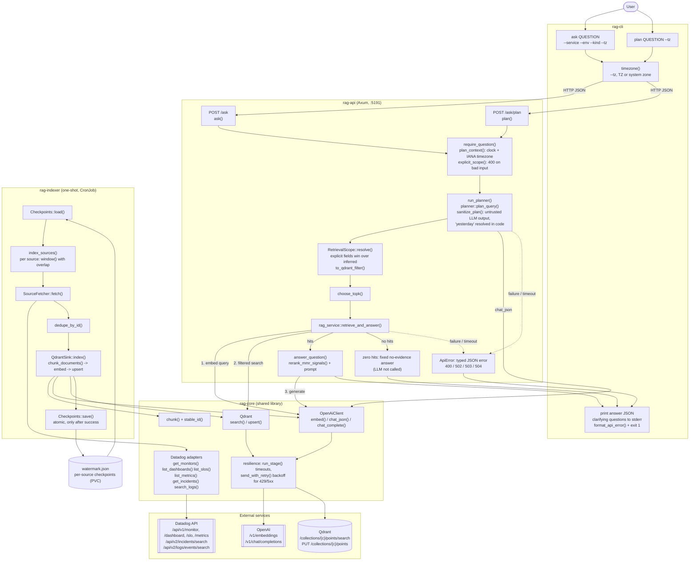

# Tails

Datadog RAG, built in Rust.

Includes a **one-shot Datadog indexer**, **RAG API**, and **CLI** with automatic inference of
`service` and `environment`. The server dynamically selects `topK` based on question intent.

---

## Quickstart

```bash
# 1. Index Datadog data into Qdrant
cd crates/rag-indexer
cargo run

# 2. Start the RAG API
cd ../rag-api
cargo run

# 3. Ask a question via CLI
cd ../rag-cli
RAG_API_BASE=http://localhost:5191 cargo run -- ask "why did auth-api spike yesterday?"
```

The server plans each question: it infers `service`/`environment`, resolves time
phrases like "yesterday" in your timezone, and applies them as Qdrant filters.  
The server chooses `K` dynamically — no `--k` flag needed.

---

## Using the CLI

Once the API is running (see [Quickstart](#quickstart)), install `rag-cli` (see
[CLI](#cli) for installers and binaries) and point it at the API:

```bash
export RAG_API_BASE=http://localhost:5191   # default
export RAG_API_TOKEN=...                    # optional bearer token

# Ask in plain language. The server infers service, environment and time window.
rag-cli ask "why did auth-api return 5xx errors yesterday?"

# Pin what you already know. Explicit flags always win over inferred values.
rag-cli ask "latency spikes after the deploy" --service auth-api --env prod

# Only use certain evidence (repeatable): logs, metrics, monitor, incident, dashboard, slo, git
rag-cli ask "what alerted overnight?" --kind monitor --kind incident

# Resolve "yesterday", "last 2 hours", ... in a specific timezone (default: your system zone)
rag-cli ask "errors in payments since yesterday" --tz Europe/Stockholm

# See how the server interprets a question, without retrieving or answering
rag-cli plan "why did checkout fail in staging last night?"
```

`ask` prints the API response as JSON: the `answer`, whether it is backed by indexed
documents (`"evidence": "found"` or `"none"`), the validated `plan`, and the `scope`
actually applied to retrieval:

```json
{
  "answer": "auth-api returned 5xx between 14:05 and 14:40 UTC ... [DOC #1] ...",
  "evidence": "found",
  "plan": { "intent": "rootCauseWindow", "service": "auth-api", "environment": "prod", "...": "..." },
  "scope": {
    "service": "auth-api",
    "environment": "prod",
    "fromUtc": "2026-09-22T22:00:00Z",
    "toUtc": "2026-09-23T22:00:00Z",
    "kinds": []
  }
}
```

If the planner is unsure about something, its clarifying questions are printed to
stderr under `Need more info:`. If a step fails (planning, embedding, search or
generation), no answer is printed. The CLI prints the typed error, for example
`error [upstream_unavailable] at stage 'retrieval' (HTTP 503): ...`, and exits with
status 1. See [API errors and evidence](#api-errors-and-evidence).

---

## Crates Overview

| Crate | Description |
|-------|--------------|
| `rag-core` | Domain models, OpenAI, Qdrant (search + upsert), Datadog client (monitors, incidents, logs, dashboards, metrics, SLOs), chunker, planner, reranker, RAG service. |
| `rag-api` | Axum REST API — `/ask/plan` (intent + inferred filters) and `/ask` (server-side planning + filtered retrieval + answer). |
| `rag-cli` | CLI that calls the API. The server plans (service/env/time) and decides top-K. |
| `rag-indexer` | One-shot, resumable indexer for Datadog → Qdrant with per-source checkpoints. Perfect for Kubernetes CronJob. |

---

## How it fits together

There are two flows. **Ingestion** (`rag-indexer`, run on a schedule) copies Datadog
data into Qdrant as embedded chunks. **Questions** (`rag-cli` → `rag-api`) plan the
question, search those chunks with the resulting filters, and have the LLM answer only
from what was found.



What each part does:

- **rag-cli**: turns `ask` and `plan` commands into HTTP calls to the API, adds your
  timezone, prints the JSON response, and prints typed errors and exits non-zero.
- **rag-api**:
  - validates the request (`400` on bad input);
  - asks the planner for intent, service, environment and time window. Planner output
    is treated as untrusted, and relative times like "yesterday" are resolved in code;
  - merges the plan with explicit request fields into a `RetrievalScope`, which becomes
    the Qdrant filter;
  - runs `retrieve_and_answer`: embed the query, search Qdrant, rerank, and generate
    an answer.
  - Zero hits give a fixed no-evidence answer without calling the LLM. Failures and
    timeouts become typed `502`/`503`/`504` errors, never an answer.
- **rag-core**: the shared library.
  - The OpenAI client (embeddings and chat), the Qdrant client (search and upsert), and
    the Datadog adapters.
  - The planner, the retrieval scope and the reranker.
  - The chunker (stable chunk IDs, so re-indexing overwrites instead of duplicating).
  - `resilience`: per-stage timeouts, the overall request deadline, and bounded retries
    for 429 and 5xx responses.
- **rag-indexer**: for each Datadog source, computes a window from that source's
  checkpoint (with overlap for late data). It then fetches, deduplicates, chunks, embeds
  and upserts, and advances that source's checkpoint only after success. One failing
  source doesn't block the others.
- **External services**:
  - **Datadog**: the source of monitors, dashboards, SLOs, metric names, incidents and
    logs.
  - **OpenAI**: embeddings, planning, and answers.
  - **Qdrant**: the vector store the API searches.

---

## Development

### Prerequisites

- Rust (latest stable)
- Docker (for containerization)
- ~~NASM (for cryptographic aws_lc_rs feature)~~ - NO LONGER REQUIRED, using native-tls instead, leaving this here in case I decide to move back to rustls in the future for better performance
- ~~CMake (for cryptographic aws_lc_rs feature)~~ - NO LONGER REQUIRED, using native-tls instead, leaving this here in case I decide to move back to rustls in the future for better performance

## Environment Variables

```
# OpenAI
OPENAI_API_KEY=...
OPENAI_EMBEDDING_MODEL=text-embedding-3-small
OPENAI_CHAT_MODEL=o4-mini

# Qdrant
QDRANT_ENDPOINT=http://qdrant:6333
QDRANT_COLLECTION=datadog_rag

# Datadog
DD_API_KEY=...
DD_APP_KEY=...
DD_SITE=datadoghq.eu    # or datadoghq.com

# Indexer
INDEXER_WATERMARK=/data/watermark.json   # per-source checkpoint file
INDEXER_LOOKBACK_MINUTES=90              # window for a source's first run
INDEXER_OVERLAP_MINUTES=10               # re-read before each checkpoint for late arrivals

# Retrieval tuning (optional)
RAG_TOPK_DEFAULT=16
RAG_TOPK_MAX=32
RAG_SEARCH_CANDIDATES=64

# Timeouts, deadlines and retries (optional; milliseconds)
RAG_HTTP_CONNECT_TIMEOUT_MS=5000     # per connection attempt (OpenAI + Qdrant clients)
RAG_HTTP_REQUEST_TIMEOUT_MS=60000    # per HTTP attempt
RAG_ASK_DEADLINE_MS=90000            # overall deadline for one /ask request
RAG_PLAN_TIMEOUT_MS=30000            # /ask/plan planning stage
RAG_EMBED_TIMEOUT_MS=15000           # embedding stage (incl. retries)
RAG_SEARCH_TIMEOUT_MS=15000          # Qdrant search stage (incl. retries)
RAG_GENERATE_TIMEOUT_MS=60000        # answer generation stage (incl. retries)
RAG_RETRY_MAX_ATTEMPTS=3             # total attempts per upstream call (1 = no retries)
RAG_RETRY_BASE_DELAY_MS=200          # first backoff; doubles per retry, with jitter
RAG_RETRY_MAX_DELAY_MS=10000         # backoff cap; a longer Retry-After fails fast
```

---

## API errors and evidence

`/ask` and `/ask/plan` never turn an infrastructure failure into an answer.
If embedding, retrieval, planning or generation fails, the API returns an
error status with a stable JSON body, and the LLM is not asked to answer
after an embedding or retrieval failure:

```json
{"error": {"code": "retrieval_failed", "message": "retrieval failed: upstream returned HTTP 404", "stage": "retrieval", "retryable": false}}
```

| Status | `code` | When |
|--------|--------|------|
| 400 | `invalid_request` | Malformed JSON, missing or empty `question` |
| 502 | `embedding_failed`, `retrieval_failed`, `generation_failed`, `planning_failed` | Upstream (OpenAI/Qdrant) rejected the call or returned an invalid response; not retried |
| 503 | `upstream_unavailable` | Transient upstream failure (connect error, 429, 5xx) persisted after all retries |
| 504 | `timeout` | A stage timeout or the overall `/ask` deadline was exceeded |
| 500 | `internal` | Unexpected internal error |

`stage` is one of `planning`, `embedding`, `retrieval`, `generation` or
`request` (`null` for invalid requests). Messages never include upstream
response bodies, URLs or credentials; details are logged server-side.

A successful search that matches nothing is **not** an error: `/ask` returns
200 with `"evidence": "none"` and a fixed "No matching evidence was found in the
indexed data" answer, without calling the LLM (so it cannot invent evidence).
Answers backed by retrieved documents have `"evidence": "found"`.

Retries apply only to transient failures (connect errors, timeouts, HTTP 429
honoring `Retry-After`/`retry-after-ms`, and 5xx) with exponential backoff and
jitter; other 4xx responses are never retried. No retry starts if its backoff
would end past the stage or request deadline. The CLI prints typed errors as
`error [code] at stage '...' (HTTP status): message` and exits non-zero.

---

## Running

### API
```
cd crates/rag-api
cargo run
```

### CLI

**Quick Install** (recommended):

Linux/macOS:
```bash
curl -fsSL https://raw.githubusercontent.com/MattiasHognas/tails/main/install.sh | bash
```

Windows (PowerShell):
```powershell
irm https://raw.githubusercontent.com/MattiasHognas/tails/main/install.ps1 | iex
```

The installer will:
- Detect your platform automatically
- Download the latest release
- Update existing installation if found
- Add to PATH (on Windows)

**Advanced Installation Options**:

Install to a custom directory (Linux/macOS):
```bash
INSTALL_DIR=/usr/local/bin VERSION=v1.0.0 bash install.sh
```

Install to a custom directory (Windows):
```powershell
.\install.ps1 -InstallDir "C:\Tools\rag-cli" -Version "v1.0.0"
```

Default installation locations:
- Linux/macOS: `$HOME/.local/bin/rag-cli`
- Windows: `%LOCALAPPDATA%\rag-cli\rag-cli.exe`

**Manual Download**:
- Linux (x86_64): `rag-cli-linux-x86_64`
- Linux (aarch64): `rag-cli-linux-aarch64`
- macOS (Intel): `rag-cli-macos-x86_64`
- macOS (Apple Silicon): `rag-cli-macos-aarch64`
- Windows (x86_64): `rag-cli-windows-x86_64.exe`

Binaries are automatically built and available as [GitHub Release](https://github.com/MattiasHognas/tails/releases) artifacts.

**Build from source** (development)
```
cd crates/rag-cli
RAG_API_BASE=http://localhost:5191 cargo run -- ask "why did auth-api spike yesterday?"
```

> No `--k` flag — server dynamically chooses K.  
> No `--env` or `--service` needed — planner infers them automatically (e.g., “auth-api prod”).

Manual override if desired (explicit flags always win over inferred values):
```
cargo run -- ask "auth-api latency spikes" --env prod --service auth-api --kind logs --tz Europe/Stockholm
```

`--tz` defaults to `TZ` (when it is an IANA name) or the system timezone.

### Indexer (manual run)
```
cd crates/rag-indexer
INDEXER_WATERMARK=./watermark.json DD_API_KEY=... DD_APP_KEY=... DD_SITE=datadoghq.eu OPENAI_API_KEY=... QDRANT_ENDPOINT=http://localhost:6333 QDRANT_COLLECTION=datadog_rag cargo run
```

### How the indexer resumes

Each run indexes every source (monitors, dashboards, SLOs, metrics, incidents, logs)
independently and records its progress in the checkpoint file at `INDEXER_WATERMARK`:

```json
{ "sources": { "logs": { "indexed_until": "2025-01-01T12:00:00Z" }, "incidents": { "indexed_until": "2025-01-01T11:45:00Z" } } }
```

- **Complete fetches:** every Datadog list is paginated to the end (logs via the
  `meta.page.after` cursor, 1000 per page, oldest first).
- **Per-source checkpoints:** a source's checkpoint advances to the run's start time only
  after all of its documents are embedded and upserted, and the file is rewritten
  atomically (temp file + rename). A failing source is logged and retried from its old
  checkpoint on the next run while the others advance; the run then exits non-zero.
- **Windows:** logs, incidents and metrics are fetched from their checkpoint minus
  `INDEXER_OVERLAP_MINUTES` (default 10) until now, so records that reach Datadog late
  are picked up by the next run. A source without a checkpoint starts
  `INDEXER_LOOKBACK_MINUTES` (default 90) back. After an outage, the whole gap since the
  checkpoint is fetched. Monitors, dashboards and SLOs are re-synced in full each run.
- **No duplicates:** documents are deduplicated by ID within a run, and Qdrant point IDs
  are derived from document IDs, so re-indexing overlapping records overwrites them.
- **Upgrades:** a legacy watermark file holding a single timestamp is used as the
  checkpoint for every source and rewritten in the new format. An unreadable checkpoint
  file stops the run instead of silently re-starting from the lookback; delete it to
  start over.

---

## API

### `POST /ask`

```json
{
  "question": "why did auth-api fail yesterday?",
  "timezone": "Europe/Stockholm",
  "service": null,
  "env": null,
  "from_utc": null,
  "to_utc": null,
  "kinds": null,
  "filters": null,
  "rewritten_query": null,
  "plan": null
}
```

Only `question` is required. The response is
`{"answer": "...", "evidence": "found" | "none", "plan": {...}, "scope": {"service", "environment", "fromUtc", "toUtc", "kinds"}}`,
where `plan` is the validated plan and `scope` is what was actually applied to retrieval.

- **Planning is server-side.** Unless `plan` is supplied (for example, one returned by
  `/ask/plan`), the server calls the planner. A supplied `plan` is validated exactly like
  planner output.
- **Explicit fields win**, field by field:
  - `service`/`env`: the explicit field, then a `service:`/`env:` entry in `filters`,
    then the planner's value, then a tag in the planner's `filters`.
  - Time: if either `from_utc` or `to_utc` is given, the caller's window replaces the
    inferred one entirely (a missing bound is open-ended).
  - Source kinds: `kinds`, then `kind:` entries in `filters`, then planner `kind:` filters.
    Valid kinds: `logs`, `metrics`, `monitor`, `incident`, `dashboard`, `slo`, `git`.
  - `rewritten_query`, then the planner's rewrite, then `question` is embedded.
- **`timezone`** is an IANA name (default `UTC`). The planner is given "now" in that zone.
  `today`, `yesterday`, `the day before yesterday`, `since yesterday`, and
  `last|past N minutes|hours|days|weeks` (also `last 24h`, `last week`) are resolved in
  code: `yesterday` is local midnight to local midnight, converted to UTC (23 or 25 hours
  across DST changes). An LLM window is kept only if it falls inside that range (for
  example "yesterday 14:00–15:00"); otherwise the computed range is used.
- **Validation.** Invalid explicit input (unknown timezone, non-RFC 3339 timestamps,
  `from_utc >= to_utc`, unknown `kinds`) returns `400`. Planner output is untrusted: each
  invalid field is dropped and logged instead of failing the request. A window is dropped
  when a bound fails to parse, `from >= to`, it spans more than 366 days, or a bound is
  more than 5 years in the past or more than 1 day in the future. Services and
  environments must look like Datadog tag values and are lowercased; placeholders such as
  `unknown` or `*` are rejected. Only `kind:`, `service:`, and `env:` filters are kept. If
  the planner call itself fails or times out (`RAG_PLAN_TIMEOUT_MS`), the request fails
  with a typed `planning_failed`, `upstream_unavailable` or `timeout` error (see
  [API errors and evidence](#api-errors-and-evidence)) instead of retrieving with a
  default plan. Supply `plan` to skip the planner call. Planning counts toward the
  overall `RAG_ASK_DEADLINE_MS`.
- **Retrieval filters.** Service, environment and kinds are `match` conditions. The window
  is a half-open `[from, to)` Qdrant datetime `range` on the RFC 3339 `Timestamp` payload.
  Documents with no timestamp, and monitors, dashboards and SLOs (whose timestamp, if any,
  is a creation date), always pass the time condition, so "yesterday" still surfaces the
  relevant monitor or SLO. Incidents are filtered by creation time.

### `POST /ask/plan`

`{"question": "...", "timezone": "Europe/Stockholm"}` → `{"plan": {...}}`: the
validated plan, without retrieval.

---

## Docker

### Building Images

Build server services from pre-compiled binaries:

```bash
# Build release binaries first
cargo build --release

# Build Docker images
docker build -f crates/rag-indexer/Dockerfile -t rag-indexer:latest .
docker build -f crates/rag-api/Dockerfile -t rag-api:latest .
```

### Running with Docker

**Indexer:**
```bash
docker run --rm \
  -e OPENAI_API_KEY=... \
  -e QDRANT_ENDPOINT=http://qdrant:6333 \
  -e QDRANT_COLLECTION=datadog_rag \
  -e DD_API_KEY=... \
  -e DD_APP_KEY=... \
  -e DD_SITE=datadoghq.eu \
  rag-indexer:latest
```

**API:**
```bash
docker run --rm -p 5191:5191 \
  -e OPENAI_API_KEY=... \
  -e QDRANT_ENDPOINT=http://qdrant:6333 \
  -e QDRANT_COLLECTION=datadog_rag \
  -e DD_API_KEY=... \
  -e DD_APP_KEY=... \
  -e DD_SITE=datadoghq.eu \
  rag-api:latest
```

---

## Example CronJob (Kubernetes)

```yaml
apiVersion: batch/v1
kind: CronJob
metadata:
  name: rag-indexer
spec:
  schedule: "*/15 * * * *"
  # Runs share the checkpoint file, so never let two overlap.
  concurrencyPolicy: Forbid
  jobTemplate:
    spec:
      template:
        spec:
          restartPolicy: OnFailure
          securityContext:
            fsGroup: 1000   # the image runs as UID 1000; make the volume writable
          containers:
          - name: indexer
            image: ghcr.io/yourorg/rag-indexer:latest
            env:
            - name: OPENAI_API_KEY
              valueFrom: { secretKeyRef: { name: openai, key: apiKey } }
            - name: QDRANT_ENDPOINT
              value: http://qdrant:6333
            - name: QDRANT_COLLECTION
              value: datadog_rag
            - name: DD_API_KEY
              valueFrom: { secretKeyRef: { name: datadog, key: apiKey } }
            - name: DD_APP_KEY
              valueFrom: { secretKeyRef: { name: datadog, key: appKey } }
            - name: DD_SITE
              value: datadoghq.eu
            - name: INDEXER_WATERMARK
              value: /data/watermark.json
            - name: INDEXER_LOOKBACK_MINUTES
              value: "90"
            - name: INDEXER_OVERLAP_MINUTES
              value: "10"
            volumeMounts:
            - name: data
              mountPath: /data
          volumes:
          - name: data
            persistentVolumeClaim:
              claimName: rag-indexer-data
---
# Checkpoints must survive between runs; with emptyDir every run would start over.
apiVersion: v1
kind: PersistentVolumeClaim
metadata:
  name: rag-indexer-data
spec:
  accessModes:
  - ReadWriteOnce
  resources:
    requests:
      storage: 1Gi
```

---

## Testing

### Running Tests

```bash
# Run all tests
cargo test

# Run tests for a specific crate
cargo test -p rag-core

# Run tests with output
cargo test -- --nocapture
```

### Qdrant storage contract

Ingestion and retrieval share a typed payload in `rag-core::qdrant`. Stored keys
are `Title`, `Text`, `SourceUri`, `Kind`, `Timestamp`, `Service`, `Environment`,
`Metadata`, and lowercase `id`. The payload `id` remains the logical chunk ID
(for example, `monitor_123#c0`); `Metadata.chunk_of` preserves the parent ID.
Qdrant point IDs are deterministic UUIDv5 values derived from the logical chunk ID
in a fixed Tails namespace, so retries and content updates replace the same point.

The `Qdrant contract` CI workflow runs an upsert/search test against real Qdrant.
To run it locally, start an isolated Qdrant instance, then run:

```bash
QDRANT_TEST_ENDPOINT=http://localhost:6333 cargo test --locked -p rag-core --test qdrant_roundtrip -- --ignored
```

The test creates and deletes its own uniquely named collection and checks chunk
identity, full payload recovery, filtering (including the time window), and idempotent
upserts.

Time filtering uses Qdrant's datetime `range` on the existing RFC 3339 `Timestamp`
string, so existing collections need no re-indexing. Filters work without payload
indexes; for large collections, add them for faster filtering:

```bash
curl -X PUT "$QDRANT_ENDPOINT/collections/$QDRANT_COLLECTION/index" -H 'Content-Type: application/json' -d '{"field_name": "Timestamp", "field_schema": "datetime"}'
# repeat with field_schema "keyword" for Service, Environment and Kind
```

### Mutation Testing

The project uses [cargo-mutants](https://mutants.rs/) for mutation testing to identify missing test coverage:

```bash
# Install cargo-mutants
cargo install cargo-mutants

# Run mutation tests
cargo mutants

# Run on specific package
cargo mutants --package rag-core
```

For detailed mutation testing results and recommendations, see [MUTATION_TESTING_REPORT.md](MUTATION_TESTING_REPORT.md).

**Current Test Coverage:**
- **141 unit tests** covering core functionality, API logic, and indexer
- **Mutation testing:** 43.1% caught (62/144 mutants) - **+24.7% improvement!**
- Strong coverage of OpenAI client (100%), Qdrant client (80%), and choose_topk logic (76.5%)
- See report for areas needing additional test coverage

---

## Notes

- The planner (`/ask/plan`, and `/ask` server-side) extracts **intent**, **time window**, **service/env**, and **clarifying questions**.
- The API applies the validated plan as Qdrant filters, embeds the rewritten query, searches Qdrant, and reranks results using hybrid heuristics.
- The CLI automatically displays clarifying questions if planner uncertainty is high.
- Default values can be tuned via environment variables on the API service.
