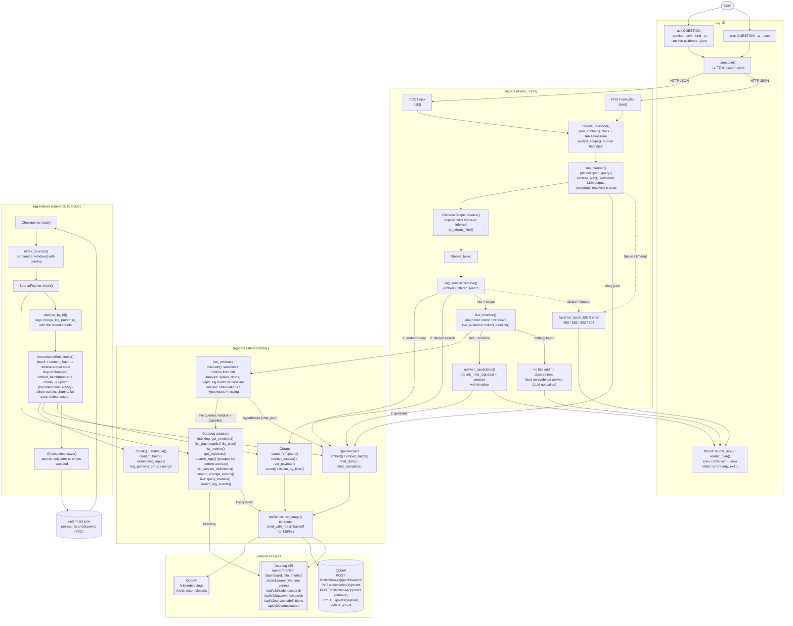

# Architecture

This document describes how Tails is put together: the components, how a question flows
through the system, how failures are reported, and how Datadog data is indexed and stored.
For building, running and testing, see [DEVELOPMENT.md](DEVELOPMENT.md).

## Overview

There are two flows. **Ingestion** (`rag-indexer`, run on a schedule) copies Datadog
data into Qdrant as embedded chunks. **Questions** (`rag-cli` → `rag-api`) plan the
question, search those chunks with the resulting filters, and have the LLM answer only
from what was found.



What each part does:

- **rag-cli**: turns `ask` and `plan` commands into HTTP calls to the API and adds your
  timezone. It renders the response as readable text on stdout (answer with `[n]`
  citations, scope and times in your timezone, evidence counts, live evidence, sources
  and clarifying questions), or prints the raw JSON with `--json`. Errors (typed API
  errors and client failures such as an unreachable API) go to stderr, as one line of
  text or, with `--json`, one line of JSON, and exit with status 1.
- **rag-api**:
  - validates the request (`400` on bad input);
  - asks the planner for intent, service, environment and time window. Planner output
    is treated as untrusted, and relative times like "yesterday" are resolved in code;
  - merges the plan with explicit request fields into a `RetrievalScope`, which becomes
    the Qdrant filter;
  - retrieves: embeds the query and searches Qdrant with that filter;
  - for diagnostic questions with a time window, collects live evidence: queries Datadog
    for the discovered services' metrics and error logs over the window and a baseline,
    and returns a `timeline` (see [Live evidence](#live-evidence-timeline));
  - reranks the hits and generates an answer from them and the timeline.
  - With no hits and no live observations it returns a fixed no-evidence answer without
    calling the LLM. Planning, embedding, retrieval and generation failures become typed
    `502`/`503`/`504` errors, never an answer; live-evidence failures are reported in the
    timeline instead.
- **rag-core**: the shared library.
  - The OpenAI client (single and batched embeddings, chat), the Qdrant client (search,
    upsert, and the retrieve/set-payload/count/delete calls of incremental indexing), and
    the Datadog adapters.
  - The planner, the retrieval scope and the reranker.
  - `live_evidence`: discovery, deterministic time-series and log analysis, and the
    timeline.
  - The chunker (stable chunk IDs, so re-indexing overwrites instead of duplicating) and
    `embedding_input()`, the context header embedded with every chunk.
  - `log_patterns`: groups error/warning logs by message pattern and UTC day for
    indexing, and counts a pattern's logs in a question's window.
  - `resilience`: per-stage timeouts, the overall request deadline, and bounded retries
    for 429 and 5xx responses.
- **rag-indexer**: for each Datadog source, computes a window from that source's
  checkpoint (with overlap for late data). It then fetches, deduplicates (for logs, merges
  each message pattern's day with its stored counts) and chunks,
  skips documents whose stored content hash is unchanged, embeds the rest in batches and
  upserts them, removes obsolete chunks (and, for monitors, dashboards, SLOs and service
  definitions, documents deleted in Datadog), and advances that source's checkpoint only
  after success. One failing source doesn't block the others.
- **External services**:
  - **Datadog**: the source of monitors, dashboards, SLOs, metric names, incidents, logs,
    service definitions (Software Catalog) and change events (deploys, configuration
    changes) for indexing, and of live time series and logs for diagnostic questions.
  - **OpenAI**: embeddings, planning, and answers.
  - **Qdrant**: the vector store the API searches.

## Crates

| Crate | Description |
|-------|--------------|
| `rag-core` | Domain models, OpenAI (chat, single and batched embeddings), Qdrant (search, upsert, and the incremental-indexing retrieve/set-payload/count/delete calls), Datadog client (monitors, incidents, logs, dashboards, metrics, SLOs, service catalog, change events), chunker, planner, reranker, RAG service. |
| `rag-api` | Axum REST API — `/ask/plan` (intent + inferred filters) and `/ask` (server-side planning + filtered retrieval + live Datadog evidence for diagnostic questions + answer). |
| `rag-cli` | CLI that calls the API. The server plans (service/env/time) and decides top-K. |
| `rag-indexer` | One-shot, resumable indexer for Datadog → Qdrant with per-source checkpoints. Perfect for Kubernetes CronJob. |

## Question pipeline

`POST /ask` and `POST /ask/plan` are documented in the [README](../README.md#api). This
is how the server interprets a request:

- **Planning is server-side.** Unless `plan` is supplied (for example, one returned by
  `/ask/plan`), the server calls the planner. A supplied `plan` is validated exactly like
  planner output.
- **Explicit fields win**, field by field:
  - `service`/`env`: the explicit field, then a `service:`/`env:` entry in `filters`,
    then the planner's value, then a tag in the planner's `filters`. Explicit values are
    trimmed and lowercased like everything else that meets the stored payload.
  - Time: if either `from_utc` or `to_utc` is given, the caller's window replaces the
    inferred one entirely (a missing bound is open-ended).
  - Source kinds: `kinds`, then `kind:` entries in `filters`, then planner `kind:` filters.
    Valid kinds: `logs`, `metrics`, `monitor`, `incident`, `dashboard`, `slo`, `git`,
    `catalog` (service catalog entries; also `service_catalog`) and `change` (deploys and
    configuration changes; also `deploy`, `deployment`).
  - `rewritten_query`, then the planner's rewrite, then `question` is embedded.
- **`timezone`** is an IANA name (default `UTC`). The planner is given "now" in that zone.
  `today`, `yesterday`, `the day before yesterday`, `since yesterday`, and
  `last|past N minutes|hours|days|weeks` (also `last 24h`, `last week`) are resolved in
  code: `yesterday` is local midnight to local midnight, converted to UTC (23 or 25 hours
  across DST changes). An LLM window is kept only if it falls inside that range (for
  example "yesterday 14:00–15:00"); otherwise the computed range is used.
- **Validation.** Invalid explicit input (unknown timezone, non-RFC 3339 timestamps,
  `from_utc >= to_utc`, unknown `kinds`) returns `400`. Planner output is untrusted: each
  invalid field is dropped and logged instead of failing the request. A window is dropped
  when a bound fails to parse, `from >= to`, it spans more than 366 days, or a bound is
  more than 5 years in the past or more than 1 day in the future. Services and
  environments must look like Datadog tag values and are lowercased; placeholders such as
  `unknown` or `*` are rejected. Only `kind:`, `service:`, and `env:` filters are kept. If
  the planner call itself fails or times out (`RAG_PLAN_TIMEOUT_MS`), the request fails
  with a typed `planning_failed`, `upstream_unavailable` or `timeout` error (see
  [API errors and evidence](#api-errors-and-evidence)) instead of retrieving with a
  default plan. Supply `plan` to skip the planner call. Planning counts toward the
  overall `RAG_ASK_DEADLINE_MS`.
- **Retrieval filters.** Service, environment and kinds are `match` conditions. Qdrant
  keyword matches are case-sensitive, so the Datadog adapters store `Service` and
  `Environment` trimmed and lowercased, the form planner and explicit values take. The
  window is a half-open `[from, to)` Qdrant datetime `range` on the RFC 3339 `Timestamp`
  payload. A [log pattern](#log-patterns) document covers one UTC day and matches when
  that day's first to last log overlaps the window: `Metadata.first_seen < to` and its
  `Timestamp` (the day's last log) `>= from`. Whether it logged inside the window is then
  checked by hour (see [Retrieval and ranking](#retrieval-and-ranking)). Documents with no
  timestamp, and monitors, dashboards, SLOs (whose timestamp,
  if any, is a creation date) and metric catalog entries (stamped with the indexing run's
  time), always pass the time condition, so "yesterday" still surfaces the relevant
  monitor, SLO or metric. Service catalog entries are undated and pass it too. Incidents
  are filtered by creation time and change events by event time. Dashboards and metric
  entries carry no service or environment, so a service or environment scope excludes
  them; service catalog entries carry a service but no environment, so an environment
  scope excludes them.

## Live evidence (`timeline`)

Indexed documents say which monitors and metrics exist; they cannot show whether latency
actually spiked. For diagnostic questions `/ask` also queries Datadog for the question's
window and returns what it measured:

- **When it runs.** The planner intent is `rootCauseWindow` or `metricQuestion` (a keyword
  heuristic such as "why", "spike", "latency" applies only when the intent is `unknown`),
  the resolved `scope` has a window (explicit `from_utc`/`to_utc` or an inferred one such as
  "yesterday"; an open end is "now"), `RAG_LIVE_EVIDENCE` is on and Datadog credentials are
  configured. `"live_evidence": false` in the request disables it; `true` runs it for any
  question with a window.
- **Discovery.** Services come from the scope's service and the retrieved hits; metrics
  from the plan's `metric`, metric documents and monitor queries (the name before the
  `{...}` scope, e.g. `trace.http.request.duration` in
  `avg(last_5m):avg:trace.http.request.duration{service:auth-api} > 2`, keeping `avg`/`sum`/
  `min`/`max`). Both are ranked by summed retrieval score, the scope's service and planned
  metric first, and capped (`RAG_LIVE_MAX_SERVICES`, `RAG_LIVE_MAX_METRICS`).
- **Queries.** Each metric: `GET /api/v1/query` as
  `avg:<metric>{service:<svc>,env:<env>}` over the window plus an equal-length baseline just
  before it. Each service: `POST /api/v2/logs/events/search` for
  `service:<svc> env:<env> status:(error OR warn)` in the window (up to
  `RAG_LIVE_MAX_LOG_EVENTS`). Queries run concurrently with bounded retries and share
  `RAG_LIVE_EVIDENCE_TIMEOUT_MS`, inside the overall `/ask` deadline.
- **Analysis (in code).** Per series: count/min/max/mean/stddev/p5/p50/p95 for window and
  baseline. A *spike* is at least two consecutive points above
  `p95 + max(0.5·|p95|, 3·stddev)` of the baseline (one point if above
  `p95 + max(2·|p95|, 3·stddev)`); a *drop* mirrors this below
  `p5 - max(|p5|/3, 3·stddev)` (`p5 - max(2·|p5|/3, 3·stddev)` for one point). Three or more missing intervals are a *gap*. Fewer than 5 baseline points
  disables spike/drop detection. Logs are counted per ~1/24 of the window (at least one
  minute); a *burst* is a run of buckets with at least `max(5, 3 × median)` events. Top
  messages are grouped by the same pattern as indexed logs (numbers, UUIDs and IDs
  masked; see [Log patterns](#log-patterns)).
- **Hypotheses** are requested from the LLM only when there are observations, and every one
  must cite observation IDs; hypotheses citing none or unknown IDs are dropped. The answer
  prompt receives the timeline and must separate observed facts from hypotheses.
- **Failures never fail `/ask`.** A failed or timed-out query, an empty series, a missing
  baseline or a cap is logged and listed in `missingEvidence`. Observations are never
  fabricated. With no retrieved documents but live observations, the answer is generated
  from the observations (`"evidence": "found"`).

```json
"timeline": {
  "status": "collected",
  "window": {"fromUtc": "2026-09-22T22:00:00Z", "toUtc": "2026-09-23T22:00:00Z"},
  "baseline": {"fromUtc": "2026-09-21T22:00:00Z", "toUtc": "2026-09-22T22:00:00Z"},
  "observations": [{
    "id": "obs-2", "kind": "spike", "source": "metricQuery", "service": "auth-api",
    "query": "avg:trace.http.request.duration{env:prod,service:auth-api}",
    "startUtc": "2026-09-23T10:00:00Z", "endUtc": "2026-09-23T11:00:00Z",
    "summary": "…: 2 point(s) above the baseline band (0.3); extreme 1.5 at 2026-09-23T10:00:00Z vs baseline p95 0.2",
    "values": {"points": 2, "peak": 1.5, "threshold": 0.3, "baselineReference": 0.2, "ratioToBaseline": 7.5},
    "link": "https://app.datadoghq.eu/metric/explorer?exp_metric=trace.http.request.duration&…"
  }],
  "hypotheses": [{"statement": "Connection pool exhaustion slowed requests", "observationIds": ["obs-2", "obs-3"]}],
  "missingEvidence": [{"subject": "metrics for payments", "reason": "no_metrics_discovered", "detail": "…"}]
}
```

`kind` is `spike`, `drop`, `gap`, `seriesSummary`, `logBurst` or `logSummary`; `source` is
`metricQuery` or `logQuery`. `reason` is one of `skipped`, `no_metrics_discovered`,
`query_failed`, `timed_out`, `series_empty`, `no_baseline`, `capped`, `hypotheses_failed`.
When nothing ran, `status` is `skipped` with `skipReason` `not_diagnostic`, `disabled`,
`disabled_by_request`, `not_configured`, `window_not_specified`, `window_too_long` or
`nothing_to_query` (all but `not_diagnostic` also add a `missingEvidence` entry).

## API errors and evidence

`/ask` and `/ask/plan` never turn an infrastructure failure into an answer.
If embedding, retrieval, planning or generation fails, the API returns an
error status with a stable JSON body, and the LLM is not asked to answer
after an embedding or retrieval failure:

```json
{"error": {"code": "retrieval_failed", "message": "retrieval failed: upstream returned HTTP 404", "stage": "retrieval", "retryable": false}}
```

| Status | `code` | When |
|--------|--------|------|
| 400 | `invalid_request` | Malformed JSON, missing or empty `question` |
| 502 | `embedding_failed`, `retrieval_failed`, `generation_failed`, `planning_failed` | Upstream (OpenAI/Qdrant) rejected the call or returned an invalid response; not retried |
| 503 | `upstream_unavailable` | Transient upstream failure (connect error, 429, 5xx) persisted after all retries |
| 504 | `timeout` | A stage timeout or the overall `/ask` deadline was exceeded |
| 500 | `internal` | Unexpected internal error |

`stage` is one of `planning`, `embedding`, `retrieval`, `generation` or
`request` (`null` for invalid requests). Messages never include upstream
response bodies, URLs or credentials; details are logged server-side.

A successful search that matches nothing is **not** an error: `/ask` returns
200 with `"evidence": "none"` and a fixed "No matching evidence was found in the
indexed data" answer, without calling the LLM (so it cannot invent evidence).
Answers backed by retrieved documents have `"evidence": "found"`, and `sources` lists the
documents given to the answer model (`n`, `id`, `title`, `kind`, `timestamp`, `service`,
`environment`, `uri`) in the same order and numbering as the prompt's `[DOC #n]`
citations; `id` is the indexed document (the chunk's `Metadata.chunk_of`; for a log
pattern, the day that represents it). `sources` is empty when the LLM was not called.

### Citation checks

The answer text is returned as generated, but its citations are checked with
`rag_core::citations::validate_citations`: every `DOC #n` (bracketed, grouped like
`[DOC #1, DOC #3]`, or bare) must be a number in `sources`, and every `obs-N` must be an
observation in `timeline`. Those that resolve to nothing are listed in
`citationWarnings` (always present, usually empty) and logged:

```json
"citationWarnings": [{"citation": "DOC #7", "reason": "unknown_document"},
                     {"citation": "obs-9", "reason": "unknown_observation"}]
```

Retries apply only to transient failures (connect errors, timeouts, HTTP 429
honoring `Retry-After`/`retry-after-ms`, and 5xx) with exponential backoff and
jitter; other 4xx responses are never retried. No retry starts if its backoff
would end past the stage or request deadline. The CLI prints typed errors as
`error [code] at stage '...' (HTTP status): message` (or passes the JSON body through
with `--json`) on stderr and exits with status 1.

## Retrieval and ranking

- **Candidates:** Qdrant returns up to `RAG_SEARCH_CANDIDATES` (default 64) hits for the
  embedded query, restricted by the scope filter.
- **Top-K:** `choose_topk()` picks how many hits the answer uses. It starts at
  `RAG_TOPK_DEFAULT` (16), adds 6 for root-cause questions ("why", "root cause", "rca"),
  2 for explicit time ranges and 2 for incident questions, capped at `RAG_TOPK_MAX` (32).
  `RAG_TOPK_FIXED` overrides this (clamped to 1–64).
- **Log pattern days outside the window:** with a window, a [log pattern](#log-patterns)
  day whose hourly counts have no log in it (for example a day logged at 09:00 and 13:00,
  asked about 10:00–12:00) is dropped before reranking. An hour counts when it overlaps
  the window between the day's first and last log.
- **Reranking:** `rerank_mmr_signals()`:
  - weights scores by source kind (incident 1.10, monitor 1.05, SLO 1.03, change 1.02,
    service catalog, dashboard and metrics 1.00, logs 0.98). A deploy or config change is a
    frequent root-cause lead but does not state the problem itself; catalog entries are
    undated, so they are never decayed, and a higher weight would put a service's catalog
    entry on top of every question about that service;
  - applies a 24-hour recency half-life, never cutting a score below half;
  - keeps the best hit per source, also when there are fewer candidates than K, so a
    source is never numbered twice. A source is a document (its chunks share
    `Metadata.chunk_of`) or a log pattern (its days share `Metadata.pattern_id`); ties go
    to the lower ID;
  - selects the top-K with maximal marginal relevance, so near-duplicate text is skipped.
- **Answering:** `answer_candidates()` sends the selected documents (title, kind, time,
  service, environment, source link and key metadata) and, when collected, the rendered
  live-evidence timeline to the chat model. A log pattern is shown as its representative
  day plus a line counting all of its retrieved days, per calendar day in the asker's
  timezone (the request's `timezone`):

  ```text
  Occurrences in the question's window: 165 (Fri 2026-02-06: 120 · Mon 2026-02-09: 45; days in Europe/Helsinki, hour precision)
  ```

  With a window only the hours that overlap it count; without one, every hour of the
  retrieved days (`Occurrences on the retrieved days: …`). Counts come from each day's
  UTC hourly counts, so they are exact to the hour: an hour cut by a window bound counts
  in full, and in a timezone with a half-hour offset an hour belongs to the local day it
  starts in. Only retrieved days are counted: a pattern with more days in the window than
  fit among the search candidates is undercounted. The model is told to answer only from
  the documents and timeline, never to invent evidence, to take counts from the
  `Occurrences` line, and to keep observed facts separate from hypotheses.

## Indexing

### How the indexer resumes

Each run indexes every source (monitors, dashboards, SLOs, metrics, incidents, logs,
service catalog, change events) independently and records its progress in the checkpoint
file at `INDEXER_WATERMARK`:

```json
{ "sources": { "logs": { "indexed_until": "2025-01-01T12:00:00Z" }, "incidents": { "indexed_until": "2025-01-01T11:45:00Z" } } }
```

- **Complete fetches:** every Datadog list is paginated to the end (logs via the
  `meta.page.after` cursor, 1000 per page, oldest first).
- **Per-source checkpoints:** a source's checkpoint advances to the run's start time only
  after all of its writes succeeded (upserts, obsolete-chunk deletes and, for monitors,
  dashboards, SLOs and service definitions, sync markers and stale-document deletes), and the file is rewritten
  atomically (temp file + rename). A failing source is logged and retried from its old
  checkpoint on the next run while the others advance; the run then exits non-zero.
- **Windows:** logs, incidents, metrics and change events are fetched from their
  checkpoint minus
  `INDEXER_OVERLAP_MINUTES` (default 10) until now, so records that reach Datadog late
  are picked up by the next run. A source without a checkpoint starts
  `INDEXER_LOOKBACK_MINUTES` (default 90) back. After an outage, the whole gap since the
  checkpoint is fetched. Monitors, dashboards, SLOs and service definitions are re-synced
  in full each run.
- **Optional sources:** the service catalog and change events can be switched off with
  `INDEXER_SERVICE_CATALOG_ENABLED=false` and `INDEXER_CHANGE_EVENTS_ENABLED=false`
  (for example when the application key lacks their permission). A disabled source is not
  fetched; its checkpoint and stored points are left as they are.
- **No duplicates:** documents are deduplicated by ID within a run, and Qdrant point IDs
  are derived from document IDs, so re-indexing overlapping records overwrites them. An
  overlapping record that hasn't changed is not embedded again (see
  [Incremental indexing](#incremental-indexing)).
- **Upgrades:** a legacy watermark file holding a single timestamp is used as the
  checkpoint for every source and rewritten in the new format. An unreadable checkpoint
  file stops the run instead of silently re-starting from the lookback; delete it to
  start over.

### Incremental indexing

Re-fetched documents that haven't changed are not embedded again, and points that no
longer belong to a document are removed. Per source, after the fetch:

1. **Hash.** Each document is chunked and gets a content hash (SHA-256) over all of its
   fields (text, title, URI, kind, timestamp, service, environment, metadata), the chunk
   size and overlap, the embedding model (`OPENAI_EMBEDDING_MODEL`) and a layout version.
   Changing the chunking, the model or what is embedded therefore changes every hash.
2. **Look up.** The stored `ContentHash` and `ChunkCount` of chunk points `#c0` to
   `#c{n}` of every document (`n` = its new chunk count) are read in batches of 256 by
   point ID (`POST /collections/{c}/points` with `ids`).
3. **Skip unchanged.** A document whose chunks `#c0` to `#c{n-1}` all exist with the
   current hash and count is not embedded or rewritten. Points without a hash count as
   changed.
4. **Embed and upsert changed documents.** Their chunks, each with its
   [context header](#embedding-input), are embedded with batched
   requests (array `input`, at most `INDEXER_EMBED_BATCH_SIZE` texts and
   `INDEXER_EMBED_BATCH_MAX_CHARS` characters per request), and each batch is upserted
   with the hash, chunk count and (for full-sync sources) the run's sync ID. At most
   `INDEXER_EMBED_CONCURRENCY` batches (embedding plus its upserts), lookups or deletes
   are in flight at once.
5. **Shrink.** If point `#c{n}` exists, the document used to have more chunks, or an
   earlier cleanup failed: after the upserts, its points with `Metadata.chunk_index >= n`
   are deleted by filter. A document's chunks always form a prefix `#c0..#c{m-1}`, so
   probing `#c{n}` is enough.
6. **Disappeared documents (monitors, dashboards, SLOs and service definitions only).** These sources are
   fetched in full, so after a successful fetch every seen document is marked with the
   run's sync ID (`SyncId`, the run's start time): changed ones through the upsert,
   unchanged ones with `POST /collections/{c}/points/payload`, without re-embedding.
   Then every point of that kind without the current sync ID is deleted. A failed fetch
   deletes nothing, and an empty fetch while points of that kind exist is treated as
   suspicious: it logs a warning and deletes nothing unless
   `INDEXER_ALLOW_EMPTY_SYNC_DELETE=true`.
7. Logs, incidents, metrics and change events are windowed: a record missing from a
   window is never deleted. Only shrink cleanup applies to them.

Each source logs how many documents were fetched, unchanged and embedded (with their
chunk count), how many shrank, and how many stale points were deleted.

Changing the hash layout version (`CONTENT_HASH_VERSION`) changes every hash, so the
next run re-embeds every fetched document once.

### Embedding input

Each chunk is embedded with a short context header in front of its text
(`rag_core::chunk::embedding_input`):

```text
[Incident] Checkout latency degradation
service: checkout · env: prod · severity: SEV-2 · state: resolved

<chunk text>
```

The header holds the kind, the title, service and environment, and a few fields per kind:
incident severity and state, log status, monitor type, SLO type and target, service catalog
team and tier, change type (`deployment`, `configuration`, `feature_flag` or `change`) and
version. Empty fields
are left out; the title is cut at 300 bytes and other values at 100 (at a char
boundary), so a header adds at most about 800 chars to an 1800-char chunk, well within the
per-request `INDEXER_EMBED_BATCH_MAX_CHARS` budget and the model's per-input limit. Every
chunk of a document gets the header, so chunk 2 of a long runbook still carries its title,
and a log's vector names its service even when the message does not. Only the vector
changes: the stored `Text` and the answer prompt are the chunk text as before.

Everything in the header is a document field, so the content hash covers it.

### Service catalog and change events

**Service catalog** (`rag_core::service_catalog`, kind `catalog`, payload `serviceCatalog`):
`GET /api/v2/services/definitions` with `page[size]=100` (the documented maximum) and
`page[number]` from 0 until a short page; the response has no total or cursor. Each entry
is `{"id", "type", "attributes": {"schema", "meta"}}` with `schema` in the version it
was written in: v1 (`info`, `org`, `contact`, `external-resources`), v2 (`dd-service`,
`team`, `contacts`, `links`, `repos`, `docs`, PagerDuty as a URL string), v2.1 (adds
`description`, `application`, `tier`, `lifecycle`, PagerDuty/Opsgenie objects) and v2.2
(adds `languages`, `type`). A v3 entity-shaped schema (`apiVersion: v3`, `metadata`,
`spec`) is read too; it is the only version with dependencies (`spec.dependsOn`). One
document per service, ID `catalog_<service>`: the service name (lowercased, the `Service`
payload), no environment and no timestamp (the definition's last modification is kept in
`Metadata.last_modified`). The text leads with owner team, contacts, on-call
(PagerDuty/Opsgenie), links (runbooks, repos, docs), then dependencies, tier, lifecycle,
type, application, languages and tags. Descriptions are cut at 2000 bytes, other values
at 300 and lists at 30 entries, at char boundaries. Fully synced like monitors.

**Change events** (`rag_core::change_events`, kind `change`): `POST /api/v2/events/search`
with `{"filter": {"from", "to", "query"}, "page": {"limit": 1000, "cursor"}, "sort":
"timestamp"}`, following `meta.page.after` like the log search. The query is
`INDEXER_CHANGE_EVENTS_QUERY`, by default
`@evt.category:change OR source:(argocd OR spinnaker OR jenkins OR gitlab OR github OR launchdarkly OR terraform)`:
Datadog change events (Change Tracking deployments, feature flags, configuration
changes) plus events from common deployment tools. Adjust it to the `source:` values and
tags your deploy pipeline uses. One document per event, ID `change_<event id>`, stamped
with the event time: title, change type, time, service (the event's `service` attribute,
else the `service:` tag, else an impacted resource of type service; `undefined` is
ignored), environment (`env:` or `environment:` tag), version (`version:` tag), commit
(`git.commit.sha:` tag and similar), author (`author.name`), changed resource and source,
then the message (at most 4000 bytes, cut at a char boundary). Windowed like logs.

Both use `send_with_retry` (429 honouring `Retry-After`, 5xx and timeouts, per
`RAG_RETRY_*`). They need the application key permissions `apm_service_catalog_read`
and `events_read`; without them the source fails with 403, the others still run, and the
run exits non-zero until the source is disabled. API calls per run: the catalog costs
`ceil(services / 100)` requests, change events `ceil(events in the window / 1000)`
(usually one).

### Log patterns

Error and warning logs are not indexed one document per log. During an incident Datadog
returns thousands of near-identical logs, which cost an embedding call each and fill the
top-K with copies of one message. `search_logs()` groups the logs of a fetch by
(service, environment, status, message pattern, UTC day) into one document each
(`rag_core::log_patterns`):

- **Pattern:** the message with whitespace collapsed, UUIDs as `<uuid>`, hex IDs of 8+
  chars and alphanumeric IDs of 16+ chars that contain a digit as `<id>`, other ASCII
  digit runs as `#`, cut at 160 chars. Live evidence groups its top messages the same way.
- **One document per day:** a pattern logged on Monday and Friday is two documents, so it
  does not match a question about Wednesday, its count for a day is that day's count, and
  a pattern logged daily for months is only recent on the days it was logged.
- **IDs:** the pattern ID `logpattern_<stable_id(service, env, status, pattern)>` is shared
  by all days of a pattern (`Metadata.pattern_id`); the document ID is
  `<pattern ID>_<YYYY-MM-DD>`, so every run updates the same point per day.
- **Document:** the text holds the pattern, the day's count, first and last log, up to 3
  distinct sample messages (each cut at 4000 bytes at a char boundary) and the 5 most
  recent log IDs. `Timestamp` is the day's last log; `Metadata` holds `status`, `pattern`,
  `pattern_id`, `day`, `count`, `first_seen`, `last_seen`, `samples`, `sample_log_ids`,
  `hour_counts` (24 counts, one per UTC hour of the day) and `minute_counts` (merge state,
  see below). The source link is a Datadog log search for the service, environment and
  status from the day's first to its last log.
- **Questions:** a day matches a window when its first to last log overlaps it
  (see [Question pipeline](#question-pipeline)); days with no log in the window's hours
  are dropped, the days of one pattern are one source, and the prompt counts the pattern
  per day in the window from the hourly counts (see
  [Retrieval and ranking](#retrieval-and-ranking)).

**Counting across runs.** Log windows overlap by `INDEXER_OVERLAP_MINUTES`, the fetch
starts at the whole minute before the window start (`F`), and a fetch can cross UTC
midnight. Before indexing, the indexer reads the stored `Metadata` of every fetched day
(`POST /collections/{c}/points` with `with_payload: ["Metadata"]`) and merges each day on
its own:

```text
hours ending at or before F     keep the stored count
hours starting at or after F    take the fetched count (they were fetched in full)
the hour containing F           stored count − stored minutes at or after F + fetched count
first seen = min(stored, fetched)    last seen = max(stored, fetched)
```

Only the hour containing `F` needs finer state, so each document keeps the per-minute
counts of the fetch that last wrote it (`minute_counts`, at most the minutes of its day).
Logs in the overlap are counted once, logs that reached Datadog late (within the overlap)
are added, and re-running a window (for example after a failed checkpoint save) changes
nothing, so the document is not re-embedded. A day the fetch starts before (a window
crossing midnight reaches the new day from its start), or before its first stored log, is
recounted from scratch. Samples keep the oldest distinct messages, log IDs the most recent.
Checkpoints only move forward, so a later fetch never starts before the stored minutes.
The exception is a checkpoint moved back (a deleted checkpoint file or a larger overlap)
to a minute that is not on a whole hour and is before the stored minutes: logs of that one
hour between the fetch start and the stored minutes can be counted twice.

A day's count changes whenever new logs arrive, so an active pattern is re-embedded once
per run for the current day, not once per log.

## Qdrant storage

Ingestion and retrieval share a typed payload in `rag-core::qdrant`. Stored keys
are `Title`, `Text`, `SourceUri`, `Kind`, `Timestamp`, `Service`, `Environment`,
`Metadata`, and lowercase `id`. The payload `id` remains the logical chunk ID
(for example, `monitor_123#c0`); `Metadata.chunk_of` preserves the parent ID.
Qdrant point IDs are deterministic UUIDv5 values derived from the logical chunk ID
in a fixed Tails namespace, so retries and content updates replace the same point.

The indexer also writes bookkeeping keys for [incremental indexing](#incremental-indexing).
They are optional: points without them still load, and count as changed on the next run.
They are not part of the returned documents, so the answer model never sees them.

| Key | Written for | Meaning |
|-----|-------------|---------|
| `ContentHash` | every chunk | Content hash of the parent document (64 hex chars) |
| `ChunkCount` | every chunk | Number of chunks of the parent document |
| `SyncId` | monitors, dashboards, SLOs, service definitions | Start time of the last run whose full fetch included the document |

Shrink cleanup filters on `Kind`, `Metadata.chunk_of` and `Metadata.chunk_index`; stale
cleanup on `Kind` and `SyncId`.

Time filtering uses Qdrant's datetime `range` on the existing RFC 3339 `Timestamp`
string, so existing collections need no re-indexing. Filters work without payload
indexes; for large collections, add them for faster filtering:

```bash
curl -X PUT "$QDRANT_ENDPOINT/collections/$QDRANT_COLLECTION/index" -H 'Content-Type: application/json' -d '{"field_name": "Timestamp", "field_schema": "datetime"}'
# repeat with field_schema "datetime" for Metadata.first_seen (log pattern days),
# "keyword" for Service, Environment, Kind, SyncId and Metadata.chunk_of,
# and "integer" for Metadata.chunk_index (used by the indexer's cleanup filters)
```
