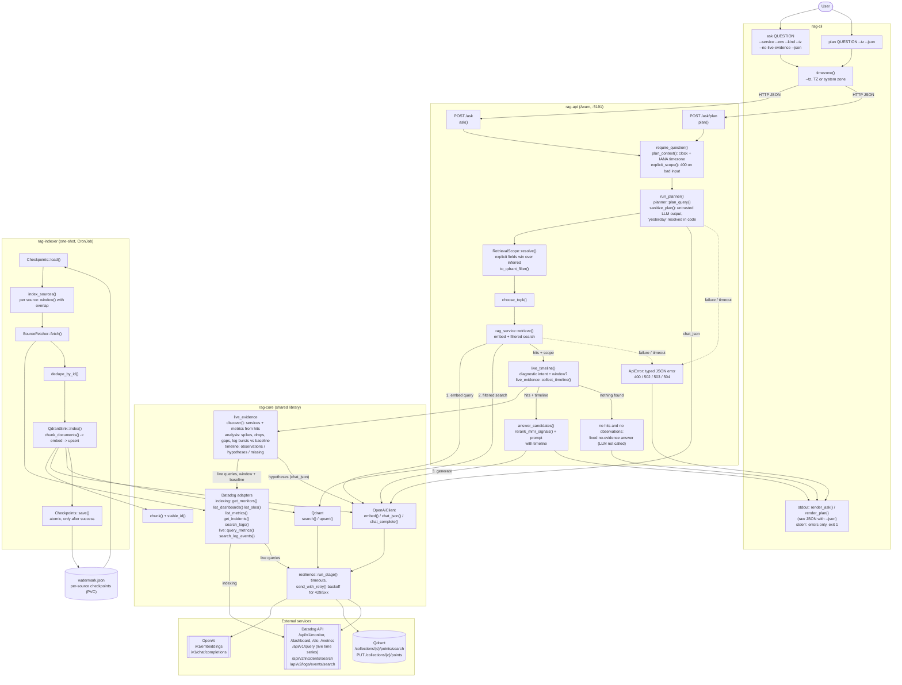

# Architecture

This document describes how Tails is put together: the components, how a question flows
through the system, how failures are reported, and how Datadog data is indexed and stored.
For building, running and testing, see [DEVELOPMENT.md](DEVELOPMENT.md).

## Overview

There are two flows. **Ingestion** (`rag-indexer`, run on a schedule) copies Datadog
data into Qdrant as embedded chunks. **Questions** (`rag-cli` → `rag-api`) plan the
question, search those chunks with the resulting filters, and have the LLM answer only
from what was found.



What each part does:

- **rag-cli**: turns `ask` and `plan` commands into HTTP calls to the API and adds your
  timezone. It renders the response as readable text on stdout (answer with `[n]`
  citations, scope and times in your timezone, evidence counts, live evidence, sources
  and clarifying questions), or prints the raw JSON with `--json`. Errors (typed API
  errors and client failures such as an unreachable API) go to stderr, as one line of
  text or, with `--json`, one line of JSON, and exit with status 1.
- **rag-api**:
  - validates the request (`400` on bad input);
  - asks the planner for intent, service, environment and time window. Planner output
    is treated as untrusted, and relative times like "yesterday" are resolved in code;
  - merges the plan with explicit request fields into a `RetrievalScope`, which becomes
    the Qdrant filter;
  - retrieves: embeds the query and searches Qdrant with that filter;
  - for diagnostic questions with a time window, collects live evidence: queries Datadog
    for the discovered services' metrics and error logs over the window and a baseline,
    and returns a `timeline` (see [Live evidence](#live-evidence-timeline));
  - reranks the hits and generates an answer from them and the timeline.
  - With no hits and no live observations it returns a fixed no-evidence answer without
    calling the LLM. Planning, embedding, retrieval and generation failures become typed
    `502`/`503`/`504` errors, never an answer; live-evidence failures are reported in the
    timeline instead.
- **rag-core**: the shared library.
  - The OpenAI client (embeddings and chat), the Qdrant client (search and upsert), and
    the Datadog adapters.
  - The planner, the retrieval scope and the reranker.
  - `live_evidence`: discovery, deterministic time-series and log analysis, and the
    timeline.
  - The chunker (stable chunk IDs, so re-indexing overwrites instead of duplicating).
  - `resilience`: per-stage timeouts, the overall request deadline, and bounded retries
    for 429 and 5xx responses.
- **rag-indexer**: for each Datadog source, computes a window from that source's
  checkpoint (with overlap for late data). It then fetches, deduplicates, chunks, embeds
  and upserts, and advances that source's checkpoint only after success. One failing
  source doesn't block the others.
- **External services**:
  - **Datadog**: the source of monitors, dashboards, SLOs, metric names, incidents and
    logs for indexing, and of live time series and logs for diagnostic questions.
  - **OpenAI**: embeddings, planning, and answers.
  - **Qdrant**: the vector store the API searches.

## Crates

| Crate | Description |
|-------|--------------|
| `rag-core` | Domain models, OpenAI, Qdrant (search + upsert), Datadog client (monitors, incidents, logs, dashboards, metrics, SLOs), chunker, planner, reranker, RAG service. |
| `rag-api` | Axum REST API — `/ask/plan` (intent + inferred filters) and `/ask` (server-side planning + filtered retrieval + live Datadog evidence for diagnostic questions + answer). |
| `rag-cli` | CLI that calls the API. The server plans (service/env/time) and decides top-K. |
| `rag-indexer` | One-shot, resumable indexer for Datadog → Qdrant with per-source checkpoints. Perfect for Kubernetes CronJob. |

## Question pipeline

`POST /ask` and `POST /ask/plan` are documented in the [README](../README.md#api). This
is how the server interprets a request:

- **Planning is server-side.** Unless `plan` is supplied (for example, one returned by
  `/ask/plan`), the server calls the planner. A supplied `plan` is validated exactly like
  planner output.
- **Explicit fields win**, field by field:
  - `service`/`env`: the explicit field, then a `service:`/`env:` entry in `filters`,
    then the planner's value, then a tag in the planner's `filters`.
  - Time: if either `from_utc` or `to_utc` is given, the caller's window replaces the
    inferred one entirely (a missing bound is open-ended).
  - Source kinds: `kinds`, then `kind:` entries in `filters`, then planner `kind:` filters.
    Valid kinds: `logs`, `metrics`, `monitor`, `incident`, `dashboard`, `slo`, `git`.
  - `rewritten_query`, then the planner's rewrite, then `question` is embedded.
- **`timezone`** is an IANA name (default `UTC`). The planner is given "now" in that zone.
  `today`, `yesterday`, `the day before yesterday`, `since yesterday`, and
  `last|past N minutes|hours|days|weeks` (also `last 24h`, `last week`) are resolved in
  code: `yesterday` is local midnight to local midnight, converted to UTC (23 or 25 hours
  across DST changes). An LLM window is kept only if it falls inside that range (for
  example "yesterday 14:00–15:00"); otherwise the computed range is used.
- **Validation.** Invalid explicit input (unknown timezone, non-RFC 3339 timestamps,
  `from_utc >= to_utc`, unknown `kinds`) returns `400`. Planner output is untrusted: each
  invalid field is dropped and logged instead of failing the request. A window is dropped
  when a bound fails to parse, `from >= to`, it spans more than 366 days, or a bound is
  more than 5 years in the past or more than 1 day in the future. Services and
  environments must look like Datadog tag values and are lowercased; placeholders such as
  `unknown` or `*` are rejected. Only `kind:`, `service:`, and `env:` filters are kept. If
  the planner call itself fails or times out (`RAG_PLAN_TIMEOUT_MS`), the request fails
  with a typed `planning_failed`, `upstream_unavailable` or `timeout` error (see
  [API errors and evidence](#api-errors-and-evidence)) instead of retrieving with a
  default plan. Supply `plan` to skip the planner call. Planning counts toward the
  overall `RAG_ASK_DEADLINE_MS`.
- **Retrieval filters.** Service, environment and kinds are `match` conditions. The window
  is a half-open `[from, to)` Qdrant datetime `range` on the RFC 3339 `Timestamp` payload.
  Documents with no timestamp, and monitors, dashboards and SLOs (whose timestamp, if any,
  is a creation date), always pass the time condition, so "yesterday" still surfaces the
  relevant monitor or SLO. Incidents are filtered by creation time.

## Live evidence (`timeline`)

Indexed documents say which monitors and metrics exist; they cannot show whether latency
actually spiked. For diagnostic questions `/ask` also queries Datadog for the question's
window and returns what it measured:

- **When it runs.** The planner intent is `rootCauseWindow` or `metricQuestion` (a keyword
  heuristic such as "why", "spike", "latency" applies only when the intent is `unknown`),
  the resolved `scope` has a window (explicit `from_utc`/`to_utc` or an inferred one such as
  "yesterday"; an open end is "now"), `RAG_LIVE_EVIDENCE` is on and Datadog credentials are
  configured. `"live_evidence": false` in the request disables it; `true` runs it for any
  question with a window.
- **Discovery.** Services come from the scope's service and the retrieved hits; metrics
  from the plan's `metric`, metric documents and monitor queries (the name before the
  `{...}` scope, e.g. `trace.http.request.duration` in
  `avg(last_5m):avg:trace.http.request.duration{service:auth-api} > 2`, keeping `avg`/`sum`/
  `min`/`max`). Both are ranked by summed retrieval score, the scope's service and planned
  metric first, and capped (`RAG_LIVE_MAX_SERVICES`, `RAG_LIVE_MAX_METRICS`).
- **Queries.** Each metric: `GET /api/v1/query` as
  `avg:<metric>{service:<svc>,env:<env>}` over the window plus an equal-length baseline just
  before it. Each service: `POST /api/v2/logs/events/search` for
  `service:<svc> env:<env> status:(error OR warn)` in the window (up to
  `RAG_LIVE_MAX_LOG_EVENTS`). Queries run concurrently with bounded retries and share
  `RAG_LIVE_EVIDENCE_TIMEOUT_MS`, inside the overall `/ask` deadline.
- **Analysis (in code).** Per series: count/min/max/mean/stddev/p5/p50/p95 for window and
  baseline. A *spike* is at least two consecutive points above
  `p95 + max(0.5·|p95|, 3·stddev)` of the baseline (one point if above
  `p95 + max(2·|p95|, 3·stddev)`); a *drop* mirrors this below
  `p5 - max(|p5|/3, 3·stddev)` (`p5 - max(2·|p5|/3, 3·stddev)` for one point). Three or more missing intervals are a *gap*. Fewer than 5 baseline points
  disables spike/drop detection. Logs are counted per ~1/24 of the window (at least one
  minute); a *burst* is a run of buckets with at least `max(5, 3 × median)` events. Top
  messages are grouped with digits masked.
- **Hypotheses** are requested from the LLM only when there are observations, and every one
  must cite observation IDs; hypotheses citing none or unknown IDs are dropped. The answer
  prompt receives the timeline and must separate observed facts from hypotheses.
- **Failures never fail `/ask`.** A failed or timed-out query, an empty series, a missing
  baseline or a cap is logged and listed in `missingEvidence`. Observations are never
  fabricated. With no retrieved documents but live observations, the answer is generated
  from the observations (`"evidence": "found"`).

```json
"timeline": {
  "status": "collected",
  "window": {"fromUtc": "2026-09-22T22:00:00Z", "toUtc": "2026-09-23T22:00:00Z"},
  "baseline": {"fromUtc": "2026-09-21T22:00:00Z", "toUtc": "2026-09-22T22:00:00Z"},
  "observations": [{
    "id": "obs-2", "kind": "spike", "source": "metricQuery", "service": "auth-api",
    "query": "avg:trace.http.request.duration{env:prod,service:auth-api}",
    "startUtc": "2026-09-23T10:00:00Z", "endUtc": "2026-09-23T11:00:00Z",
    "summary": "…: 2 point(s) above the baseline band (0.3); extreme 1.5 at 2026-09-23T10:00:00Z vs baseline p95 0.2",
    "values": {"points": 2, "peak": 1.5, "threshold": 0.3, "baselineReference": 0.2, "ratioToBaseline": 7.5},
    "link": "https://app.datadoghq.eu/metric/explorer?exp_metric=trace.http.request.duration&…"
  }],
  "hypotheses": [{"statement": "Connection pool exhaustion slowed requests", "observationIds": ["obs-2", "obs-3"]}],
  "missingEvidence": [{"subject": "metrics for payments", "reason": "no_metrics_discovered", "detail": "…"}]
}
```

`kind` is `spike`, `drop`, `gap`, `seriesSummary`, `logBurst` or `logSummary`; `source` is
`metricQuery` or `logQuery`. `reason` is one of `skipped`, `no_metrics_discovered`,
`query_failed`, `timed_out`, `series_empty`, `no_baseline`, `capped`, `hypotheses_failed`.
When nothing ran, `status` is `skipped` with `skipReason` `not_diagnostic`, `disabled`,
`disabled_by_request`, `not_configured`, `window_not_specified`, `window_too_long` or
`nothing_to_query` (all but `not_diagnostic` also add a `missingEvidence` entry).

## API errors and evidence

`/ask` and `/ask/plan` never turn an infrastructure failure into an answer.
If embedding, retrieval, planning or generation fails, the API returns an
error status with a stable JSON body, and the LLM is not asked to answer
after an embedding or retrieval failure:

```json
{"error": {"code": "retrieval_failed", "message": "retrieval failed: upstream returned HTTP 404", "stage": "retrieval", "retryable": false}}
```

| Status | `code` | When |
|--------|--------|------|
| 400 | `invalid_request` | Malformed JSON, missing or empty `question` |
| 502 | `embedding_failed`, `retrieval_failed`, `generation_failed`, `planning_failed` | Upstream (OpenAI/Qdrant) rejected the call or returned an invalid response; not retried |
| 503 | `upstream_unavailable` | Transient upstream failure (connect error, 429, 5xx) persisted after all retries |
| 504 | `timeout` | A stage timeout or the overall `/ask` deadline was exceeded |
| 500 | `internal` | Unexpected internal error |

`stage` is one of `planning`, `embedding`, `retrieval`, `generation` or
`request` (`null` for invalid requests). Messages never include upstream
response bodies, URLs or credentials; details are logged server-side.

A successful search that matches nothing is **not** an error: `/ask` returns
200 with `"evidence": "none"` and a fixed "No matching evidence was found in the
indexed data" answer, without calling the LLM (so it cannot invent evidence).
Answers backed by retrieved documents have `"evidence": "found"`, and `sources` lists the
documents given to the answer model (`n`, `title`, `kind`, `timestamp`, `service`,
`environment`, `uri`) in the same order and numbering as the prompt's `[DOC #n]`
citations. `sources` is empty when the LLM was not called.

Retries apply only to transient failures (connect errors, timeouts, HTTP 429
honoring `Retry-After`/`retry-after-ms`, and 5xx) with exponential backoff and
jitter; other 4xx responses are never retried. No retry starts if its backoff
would end past the stage or request deadline. The CLI prints typed errors as
`error [code] at stage '...' (HTTP status): message` (or passes the JSON body through
with `--json`) on stderr and exits with status 1.

## Retrieval and ranking

- **Candidates:** Qdrant returns up to `RAG_SEARCH_CANDIDATES` (default 64) hits for the
  embedded query, restricted by the scope filter.
- **Top-K:** `choose_topk()` picks how many hits the answer uses. It starts at
  `RAG_TOPK_DEFAULT` (16), adds 6 for root-cause questions ("why", "root cause", "rca"),
  2 for explicit time ranges and 2 for incident questions, capped at `RAG_TOPK_MAX` (32).
  `RAG_TOPK_FIXED` overrides this (clamped to 1–64).
- **Reranking:** `rerank_mmr_signals()`:
  - keeps the best chunk per document;
  - weights scores by source kind (incident 1.10, monitor 1.05, SLO 1.03, logs 0.98);
  - applies a 24-hour recency half-life, never cutting a score below half;
  - selects the top-K with maximal marginal relevance, so near-duplicate text is skipped.
- **Answering:** `answer_candidates()` sends the selected documents (title, kind, time,
  service, environment, source link and key metadata) and, when collected, the rendered
  live-evidence timeline to the chat model. The model is told to answer only from them,
  never to invent evidence, and to keep observed facts separate from hypotheses.

## Indexing

### How the indexer resumes

Each run indexes every source (monitors, dashboards, SLOs, metrics, incidents, logs)
independently and records its progress in the checkpoint file at `INDEXER_WATERMARK`:

```json
{ "sources": { "logs": { "indexed_until": "2025-01-01T12:00:00Z" }, "incidents": { "indexed_until": "2025-01-01T11:45:00Z" } } }
```

- **Complete fetches:** every Datadog list is paginated to the end (logs via the
  `meta.page.after` cursor, 1000 per page, oldest first).
- **Per-source checkpoints:** a source's checkpoint advances to the run's start time only
  after all of its documents are embedded and upserted, and the file is rewritten
  atomically (temp file + rename). A failing source is logged and retried from its old
  checkpoint on the next run while the others advance; the run then exits non-zero.
- **Windows:** logs, incidents and metrics are fetched from their checkpoint minus
  `INDEXER_OVERLAP_MINUTES` (default 10) until now, so records that reach Datadog late
  are picked up by the next run. A source without a checkpoint starts
  `INDEXER_LOOKBACK_MINUTES` (default 90) back. After an outage, the whole gap since the
  checkpoint is fetched. Monitors, dashboards and SLOs are re-synced in full each run.
- **No duplicates:** documents are deduplicated by ID within a run, and Qdrant point IDs
  are derived from document IDs, so re-indexing overlapping records overwrites them.
- **Upgrades:** a legacy watermark file holding a single timestamp is used as the
  checkpoint for every source and rewritten in the new format. An unreadable checkpoint
  file stops the run instead of silently re-starting from the lookback; delete it to
  start over.

## Qdrant storage

Ingestion and retrieval share a typed payload in `rag-core::qdrant`. Stored keys
are `Title`, `Text`, `SourceUri`, `Kind`, `Timestamp`, `Service`, `Environment`,
`Metadata`, and lowercase `id`. The payload `id` remains the logical chunk ID
(for example, `monitor_123#c0`); `Metadata.chunk_of` preserves the parent ID.
Qdrant point IDs are deterministic UUIDv5 values derived from the logical chunk ID
in a fixed Tails namespace, so retries and content updates replace the same point.

Time filtering uses Qdrant's datetime `range` on the existing RFC 3339 `Timestamp`
string, so existing collections need no re-indexing. Filters work without payload
indexes; for large collections, add them for faster filtering:

```bash
curl -X PUT "$QDRANT_ENDPOINT/collections/$QDRANT_COLLECTION/index" -H 'Content-Type: application/json' -d '{"field_name": "Timestamp", "field_schema": "datetime"}'
# repeat with field_schema "keyword" for Service, Environment and Kind
```
